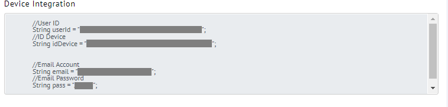

<div align="center">
  <a href="https://github.com/github_username/repo_name">
    
  </a>
  </div>
  <h3 align="center">For Your Solution IoT Platform</h3>
  <br>
  
<!-- ABOUT THE PROJECT -->
## About Diawan.io


Diawan is an IoT platform provider service that was initiated in 2020, diawan is a subsidiary of ELIT, a company engaged in software development.<br>
With diawan, Users can freely process measurement data from devices, users can carry out control schemes, users can also visualize data with many choices of display models, and users are free to report data with various time periods. Diawan also has a WhatsApp Notification feature that can make it easier for users and many others.
You can visit the site at https://diawan.io

## Features Of Diawan.io

- [ ] Monitoring
- [ ] Controlling
- [ ] Reporting
- [ ] Realtime 
- [ ] WhatsApp Notification

# HOW TO CONNECT THE DEVICE TO DIAWAN.IO
1. Download library Diawan
   ```
   https://github.com/sayadiawan/DiawanLibraries
   ```
2. Put the file in the directory 'libraries' in the Arduiono installation file
3. Ambil Identitas device anda yang ada di website diawan.io <br>     <div align="Left"><a href="https://github.com/github_username/repo_name"></a></div>
4. Salin Identitas device, lalu letakkan di bagian source kode berikut<br><div align="Left"><a href="https://github.com/github_username/repo_name"></a></div>
5. Run the Arduino file
6. Once successful, connect to your device's wifi
7. Then connect your local wifi
8. After that open the diawan website and go to the 'live show device' page. To open the 'live show device' you need to 'login' and visit <br> ```https://diawan.io/device-management/live/8420be72-c927-4a7a-ae3f-0bb0237bee03```
9. If you see a change in the sensor value, your device has successfully connected
